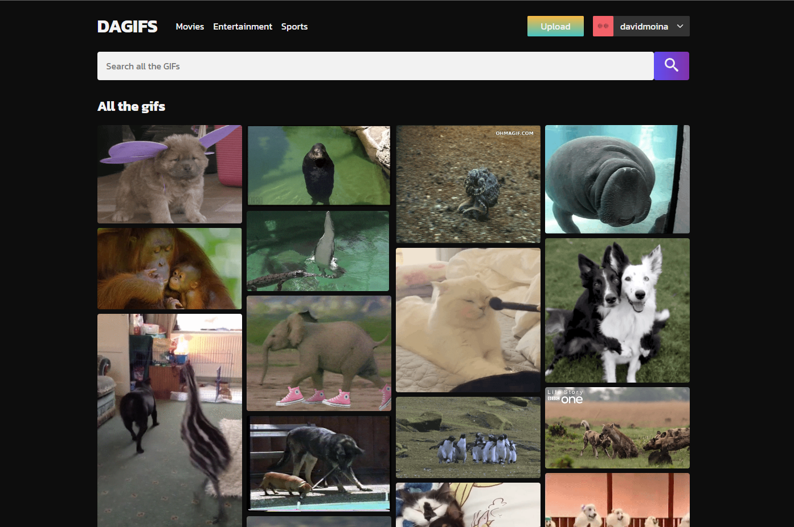
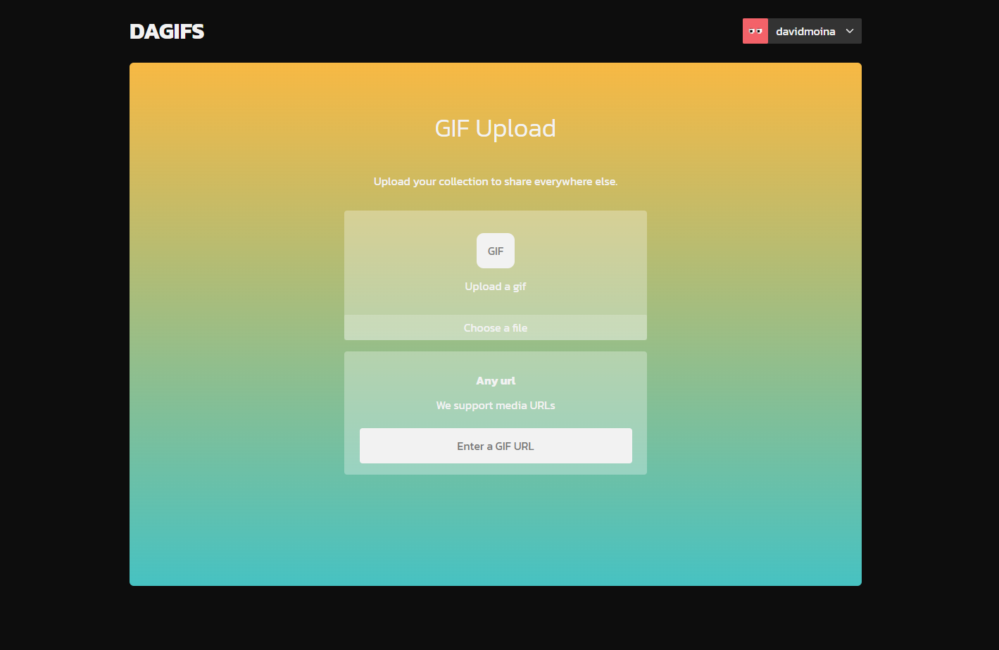
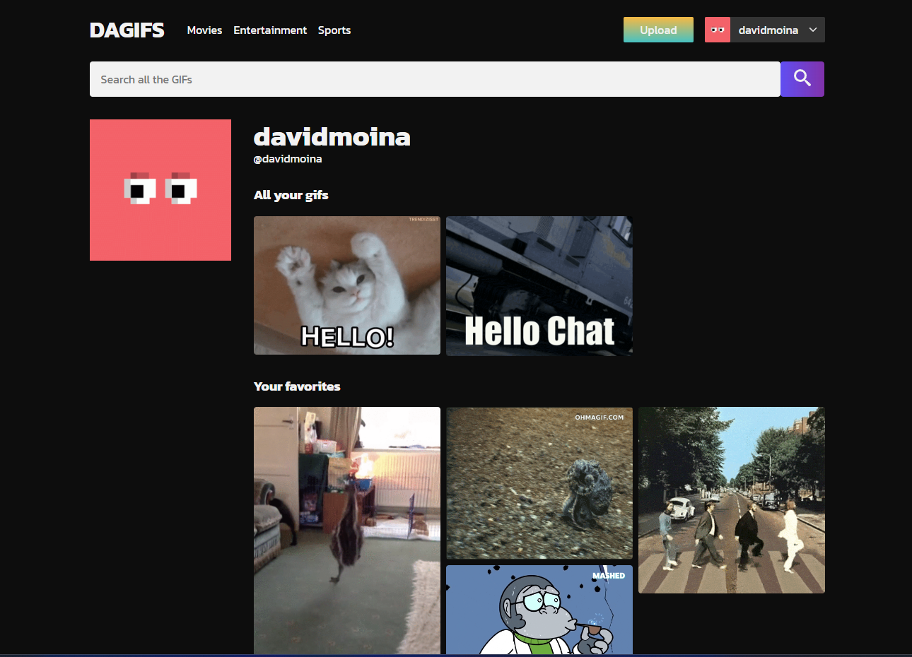

# DAGIFS

DAGIFS is a web application inspired by GIPHY that allows you to view and upload GIFs. With DAGIFS, you can explore a wide collection of GIFs, add them to your favorites, and search for GIFs by name. The application is developed using modern technologies such as React, TypeScript, Tanstack Query, Vite JS, react-router-dom, and Sass.

This application has been created for a technical test simulation developed in 3 days and is based on an already registered user.

## 🚀 Features

- Explore a wide collection of GIFs.
- Upload your own GIFs.
- Add GIFs to your favorites.
- Search for GIFs by name.

## 🖥️ Technologies Used

- React: A JavaScript library for building user interfaces.
- TypeScript: A superset of JavaScript that adds optional static typing.
- Tanstack Query: A library for managing data layer and HTTP requests.
- Vite JS: A fast and lightweight development environment for web applications.
- react-router-dom: A routing library for React applications.
- Sass: A CSS preprocessor that adds additional features and development conveniences.

## 🖼️ Screenshots

Here are some screenshots of the DAGIFS application:







## ⚙️ Installation

1. Clone the DAGIFS repository to your local machine.

   ```shell
   git clone https://github.com/davidmoina/dagifs-react.git
   ```

2. Navigate to the project directory.

   ```shell
   cd dagifs-react
   ```

3. Install the dependencies using npm.

   ```shell
   npm install
   ```

4. Start the application in development mode.

   ```shell
   npm run dev
   ```

5. Open your browser and access the following URL: [http://localhost:5173](http://localhost:5173).

## ✨ Credits

DAGIFS is developed by [David Moina](https://github.com/davidmoina).
